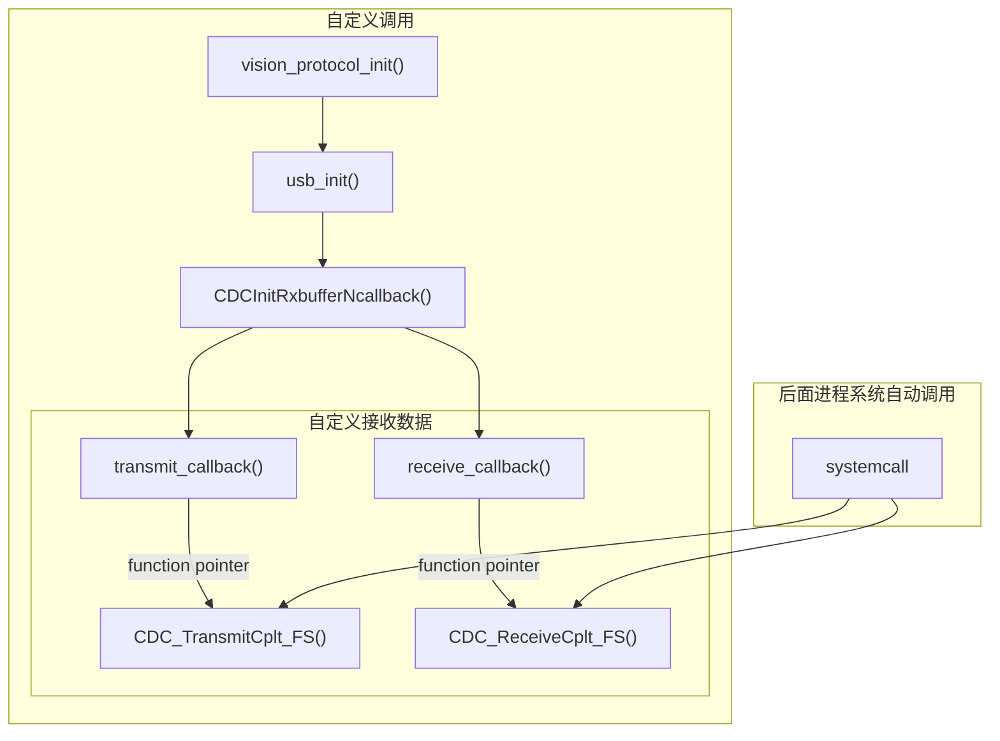
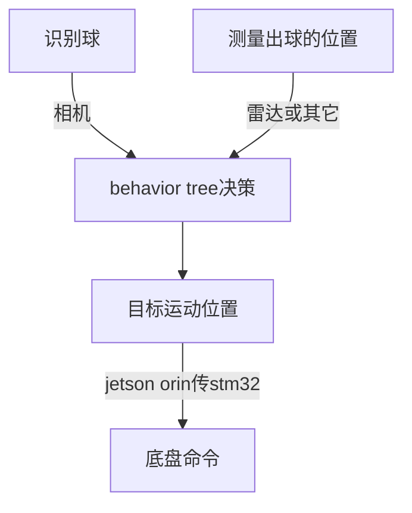

# CDC USB VDDC 上位机和C板通信
## 地盘运动初始化调用逻辑流程图

```mermaid
flowchart TB;

    subgraph 自定义调用
        direction TB
        id1["vision_protocol_init()"] --> id2["usb_init()"] -->id9["CDCInitRxbufferNcallback()"]
        id9 --> id3["transmit_callback()"]
        id9 --> id4["receive_callback()"]

        subgraph 自定义接收数据    
            direction BT
            id3--function pointer-->id5
            id4--function pointer-->id6
        end
    
    end
    


    
    subgraph 后面进程系统自动调用
    id7
    end

    id7[systemcall]-->id5["CDC_TransmitCplt_FS()"]
    id7-->id6["CDC_ReceiveCplt_FS()"] 

```

```mermaid
flowchart TB;
    id1[识别球]--相机-->id3[behavior tree决策]
    id2[测量出球的位置]--雷达或其它-->id3
    id3-->id4[目标运动位置]--jetson orin传stm32-->底盘命令
```
## TODO
- 协议转换函数
- CRC校验函数插入